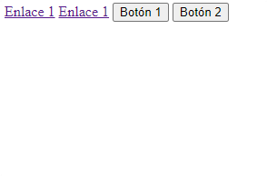
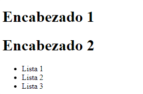

<h1 align="center">Comportamiento de los Elementos</h1>

<h2>📑 Contenido</h2>

- [Comportamiento de los Elementos en HTML](#comportamiento-de-los-elementos-en-html)
  - [Factores influyentes](#factores-influyentes)
- [Elementos en Línea](#elementos-en-línea)
  - [Ejemplo](#ejemplo)
- [Elementos en Bloque](#elementos-en-bloque)
  - [Ejemplo](#ejemplo-1)

## Comportamiento de los Elementos en HTML

El comportamiento de los elementos en HTML se refiere a cómo los elementos HTML se comportan y se presentan en una página web, incluyendo cómo interactúan con otros elementos, cómo se muestran en la pantalla y cómo responden a las acciones del usuario y a las instrucciones del desarrollador.

### Factores influyentes

- **Tipo de Elemento:** Los elementos tienen dos categorías principales en línea y bloque. En función de que elemento sea, el siguiente elementos comenzara en una nueva línea o pegado al elemento anterior.
- **Nesting (Anidación):** Los elementos HTML pueden anidarse unos dentro de otros, lo que afecta cómo se renderiza el contenido en la página y cómo se comporta. La jerarquía y la estructura de anidación pueden tener un impacto significativo en la apariencia y la interacción de los elementos.
  - Si dudas de si se puede incluir, [caninclude](https://caninclude.glitch.me/) te saca de dudas.
- **Atributos y Estilos:** Los atributos HTML y las reglas de estilo CSS aplicadas a los elementos pueden cambiar su comportamiento. Por ejemplo, los atributos pueden afectar la accesibilidad, la interacción con el usuario y otros aspectos del comportamiento.
- **Eventos y JavaScript:** Los elementos HTML pueden ser interactivos y responder a eventos del usuario, como clics, movimientos del mouse, ingreso de datos, etc. JavaScript se utiliza comúnmente para controlar el comportamiento de los elementos y crear interacciones dinámicas.
- **Modelo de Caja:** El modelo de caja de CSS define cómo se representan visualmente los elementos en términos de su tamaño, márgenes, relleno, borde y posición en la página.
- **Compatibilidad del Navegador:** El comportamiento de los elementos puede variar ligeramente según el navegador web que se esté utilizando. Es importante asegurarse de que los sitios web sean compatibles con múltiples navegadores para garantizar una experiencia consistente para los usuarios.

> [!IMPORTANT]
>
> Comprender cómo funcionan los elementos es esencial para diseñar y desarrollar sitios web eficaces y funcionales.

## Elementos en Línea

**Características:**

- Los elementos en línea ocupan el espacio mínimo necesario en horizontal. Esto significa que no comienzan en una nueva línea y permiten que otros elementos se coloquen junto a ellos en la misma línea horizontal.

- Suelen utilizarse para etiquetas que representan contenido de texto o elementos pequeños dentro de un bloque más grande, como palabras o frases en un párrafo.

- Ejemplos comunes de elementos en línea incluyen `<a>` (enlaces), `<span>` (contenedor genérico), `<strong>` (texto en negrita), `<em>` (texto enfatizado), `` (imágenes), `<input>` (campos de entrada), entre otros.

- Los elementos en línea no pueden tener márgenes verticales, solo horizontales. Además, no respetan la propiedad height, solo width.

### Ejemplo

```HTML
Ejemplo:
    <a href="">Enlace 1</a>
    <a href="">Enlace 1</a>
    <button>Botón 1</button>
    <button>Botón 2</button>
```

Resultado:



## Elementos en Bloque

**Características:**

- Los elementos en bloque ocupan todo el ancho disponible en su contenedor y comienzan en una nueva línea vertical. Esto significa que cualquier contenido que sigue a un elemento en bloque se colocará debajo de él, no al lado.
- Suelen utilizarse para estructurar el contenido en secciones más grandes y definir el diseño de la página, como encabezados, párrafos, listas, div, formularios y más.
- Ejemplos comunes de elementos en bloque incluyen `<div>` (contenedor genérico), `<p>` (párrafo), `<h1>` a `<h6>` (encabezados), `<ul>` (lista desordenada),` <ol>` (lista ordenada), `<form>` (formulario), entre otros.
- Los elementos en bloque pueden contener elementos en línea o en bloque, lo que les da una gran flexibilidad en la estructuración de la página.

### Ejemplo

```HTML
Ejemplo:
    <h1>Encabezado 1</h1>
    <h1>Encabezado 2</h1>
    <ul>
      <li>Lista 1</li>
      <li>Lista 2</li>
      <li>Lista 3</li>
    </ul>
```

Resultado:



> [!TIP]
>
> - Los elementos en línea se pueden convertir en bloques y viceversa con la propiedad display(Ver en CSS).
> - Los elementos en bloque pueden contener elementos en línea, pero no al revés.
> - Los elementos en línea pueden tener espacios en blanco entre ellos, que se pueden eliminar con la propiedad font-size: 0.
