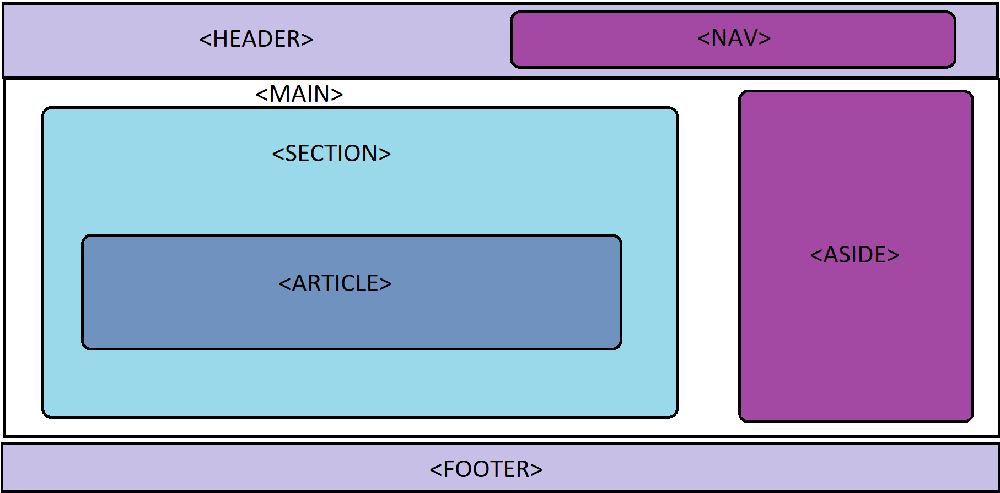

<h1 align="center">Elementos Semánticos</h1>

<h2>📑 Contenido</h2>

- [Elementos Semánticos](#elementos-semánticos)
- [Encabezados](#encabezados)
- [Cajas](#cajas)
  - [Header](#header)
  - [Nav](#nav)
  - [Main](#main)
  - [Section](#section)
  - [Article](#article)
  - [Aside](#aside)
  - [Footer](#footer)
- [Atributo Rol](#atributo-rol)
  - [Div](#div)

## Elementos Semánticos

Los elementos semánticos en HTML son etiquetas que proporcionan información adicional sobre la estructura y el significado del contenido en una página web. Estos elementos se introdujeron en versiones más recientes de HTML (HTML5) y están diseñados para mejorar la claridad del código y la comprensión del contenido tanto para los desarrolladores como para los navegadores y otras herramientas.

## Encabezados

Los encabezados en HTML se utilizan para definir títulos y subtítulos en un documento web, organizando el contenido en una estructura jerárquica. HTML proporciona seis niveles de encabezados, del h1 al h6, siendo h1 el más importante y h6 el menos importante.

```html
<h1>Título de nivel 1</h1>
<h2>Título de nivel 2</h2>
<h3>Título de nivel 3</h3>
<h4>Título de nivel 4</h4>
<h5>Título de nivel 5</h5>
<h6>Título de nivel 6</h6>
```

> [!TIP]
>
> - `<h1>`: Debe ser usado para el título principal de la página. Generalmente, solo debe haber un h1 por página para mantener una estructura clara y semántica.
> - `<h2>` a `<h6>`: Se utilizan para secciones y subsecciones dentro del contenido.
> - Mantén una jerarquía lógica y coherente en el uso de los encabezados. Por ejemplo, después de un h1, puedes usar h2 para subsecciones principales, h3 para subsecciones dentro de esas subsecciones, y así sucesivamente.
> - Una estructura de encabezados bien organizada mejora la accesibilidad para los usuarios que utilizan tecnologías asistivas, como lectores de pantalla.
> - Los motores de búsqueda también utilizan la jerarquía de encabezados para entender la estructura y el contenido de tu página, lo cual puede influir en el SEO.

## Cajas

Cajas para estructurar contenido concreto.



### Header

Es una etiqueta semántica utilizada para definir la cabecera de una sección o de una página web. Esta cabecera puede contener elementos como el título del documento, un logotipo, un menú de navegación, y otros elementos de introducción o navegación.

Puede aparecer más de una vez en una página si se usa para definir cabeceras de distintas secciones. No debe confundirse con la cabecera del documento (`<head>`), que contiene metadatos y enlaces a recursos externos.

> [!TIP]
>
> - Utiliza `<header>` para definir claramente la cabecera de tu página o secciones, mejorando la accesibilidad y la semántica del documento.
> - Mantén una estructura clara y lógica dentro del `<header>`, colocando elementos importantes como el título y la navegación en lugares destacados.

### Nav

Se utiliza para definir una sección de navegación en una página web. Esta etiqueta semántica agrupa enlaces de navegación que permiten a los usuarios desplazarse por diferentes partes del sitio web. Usar <nav> ayuda a mejorar la estructura y accesibilidad del documento, facilitando la tarea a los motores de búsqueda y a las tecnologías asistivas.

> [!TIP]
>
> - Utiliza `<nav>` para agrupar enlaces de navegación principales. No utilices `<nav>` para todos los conjuntos de enlaces, solo para aquellos que son relevantes para la navegación principal del sitio.
> - Proporciona un aria-label o aria-labelledby si tienes múltiples `<nav>` en tu página para ayudar a los usuarios que utilizan tecnologías asistivas a distinguir entre diferentes áreas de navegación.

### Main

Se utiliza para definir el contenido principal de un documento web. Este elemento semántico debe contener el contenido que es directamente relacionado con el propósito central de la página, excluyendo contenido que se repite en otras páginas, como barras laterales, menús de navegación, encabezados, y pies de página.

> [!TIP]
>
> - Solo debe haber un elemento `<main>` por documento, y no debe estar anidado dentro de `<article>, <aside>, <footer>, <header>`, o `<nav>`.

### Section

Se usa para agrupar contenido relacionado dentro de un documento. Cada sección normalmente debería tener su propio encabezado y puede contener subsecciones y otros elementos HTML. Agrupar contenido temáticamente relacionado.

> [!TIP]
>
> - Normalmente incluye un encabezado (`<h1>` a `<h6>`) para definir el tema de la sección.
> - Puede contener otras secciones (`<section>`), artículos (`<article>`), y otros elementos HTML.

### Article

Se utiliza para contener contenido independiente, autónomo y reutilizable, como artículos de blog, noticias, publicaciones de redes sociales, etc. El contenido dentro de `<article>` debe tener sentido por sí solo y ser distribuido de forma independiente.

> [!TIP]
>
> - Contener contenido independiente y autónomo.
> - Puede contener secciones (`<section>`), encabezados, párrafos, imágenes, y otros elementos HTML.

### Aside

Se utiliza para representar una sección de contenido que está indirectamente relacionada con el contenido principal. Este contenido suele estar ubicado en los laterales (como una barra lateral) o como bloques insertados en el cuerpo del documento.

> [!TIP]
>
> - Contener contenido complementario que no es parte del contenido principal, pero que está relacionado.
> - Barras laterales, cuadros de información, enlaces relacionados, anuncios, biografías de autores, etc.

### Footer

Se utiliza para representar el pie de página de una sección o de todo el documento. El contenido dentro de `<footer>` suele incluir información sobre el autor, derechos de autor, enlaces a términos de servicio, políticas de privacidad, entre otros.

> [!TIP]
>
> - Contener información de pie de página para la sección que lo contiene o para todo el documento.
> - Puede estar en cualquier parte del documento, pero comúnmente se encuentra al final del contenido principal.
> - Información de derechos de autor, enlaces de contacto, mapas de sitio, etc

## Atributo Rol

El atributo **role** es utilizado para proporcionar información adicional sobre el propósito y la función de un elemento, especialmente en el contexto de la accesibilidad web. Este atributo se utiliza para asignar roles semánticos a elementos que no poseen un significado semántico específico por sí mismos.

Algunos elementos HTML ya tienen roles semánticos incorporados (por ejemplo, `<button>` tiene implícitamente el rol de "botón"), pero en casos en los que necesitas asignar un rol adicional o modificar el comportamiento predeterminado, puedes utilizar el atributo role.

```html
<div role="alert">
  <p>¡Atención! Este es un mensaje importante.</p>
</div>
```

> [!IMPORTANT]
>
> Es importante usar el atributo role con moderación y de manera apropiada, ya que su uso excesivo o incorrecto podría afectar negativamente la accesibilidad y comprensión del contenido por parte de los usuarios. Evitar usar rol para elementos existentes de forma nativa.

### Div

La etiqueta `<div>` es un contenedor genérico que se utiliza para agrupar otros elementos HTML y aplicarles estilos o scripts. A diferencia de otras etiquetas semánticas como `<section>, <article>, <header>, <footer>`, etc., `<div>` no tiene un significado semántico propio. En cambio, es una herramienta versátil para la creación de layouts y la organización del contenido en una página web.

> [!TIP]
>
> - Agrupar elementos HTML para aplicar estilos CSS, manipulación con JavaScript, y organizar el contenido.
> - No aporta información semántica sobre el contenido que agrupa. Es un contenedor puramente estructural.
> - Se puede usar en cualquier lugar del documento HTML para agrupar y organizar otros elementos.
