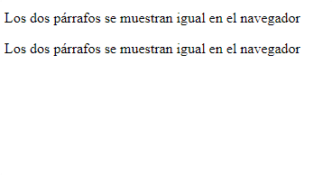
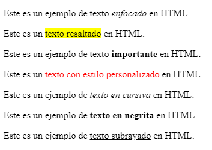
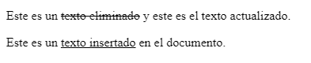
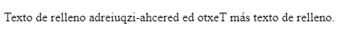
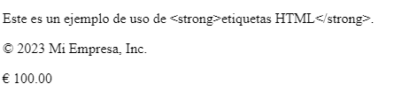

<h1 align="center">Textos</h1>

<h2>📑 Contenido</h2>

- [Párrafos](#párrafos)
- [Resaltar texto](#resaltar-texto)
- [Contenido Eliminado o Insertado](#contenido-eliminado-o-insertado)
- [Dirección del texto](#dirección-del-texto)
  - [`<bdi>`](#bdi)
  - [`<bdo>`](#bdo)
- [Citar](#citar)
- [Fecha y Hora](#fecha-y-hora)
- [Agrupar información(contactos)](#agrupar-informacióncontactos)
- [Acrónimos](#acrónimos)
- [Entidades](#entidades)
- [Texto Maquina](#texto-maquina)
  - [code](#code)
  - [kbd](#kbd)
  - [samp](#samp)
- [Comentarios](#comentarios)

## Párrafos

Para insertar un párrafo se utiliza la etiqueta `<p>`

`<p>Esto es texto de relleno</p>`

- Los párrafos se comportan en forma de bloque.
- Los párrafos pueden contener otras etiquetas.
  `<a>,<span>,<strong>,<small>,<mark>...`
- Para hacer un salto de línea dentro de un párrafo se puede utilizar la etiqueta `<br>`
- Los saltos de línea( Con Enter <-| ) y el exceso de espacio en blanco o tab dentro de un párrafo no son visibles en el navegador.
- Si quieres que te detecte los saltos de línea se puede usar la etiqueta `<pre></pre>` para mostrar el código tal cual.

**Ejemplo**

```HTML
<!--  saltos de línea -->
 <p>
      Los
      dos
      párrafos
      se
      muestran
      igual
      en
      el
      navegador
    </p>

    <p>Los dos párrafos se muestran igual en el navegador</p>
```

**Resultado:**



> [!TIP]
>
> Si quieres hacer un salto de línea dentro de un párrafo utiliza la etiqueta `<br>`. <br>
> También se puede utilizar `<wbr>` para sugerir un salto de línea donde el navegador decide dividir la palabra.
>
> - `<br>` Fuerza el sato de línea
> - `<wbr>` Sugiere al navegador un sato de línea

## Resaltar texto

Para editar un texto concreto, ya sea para enfatizar, resaltar, subrayar... Se pueden utilizar varias etiquetas y no recurrir al CSS.

> [!IMPORTANT]
>
> No utilizar estas etiquetas para dar estilos, para dar estilos a la web se utiliza CSS. Estas etiquetas se usan para agregar contenido mas haya de lo estético. Enfatizar un párrafo, resaltar o subrayar un texto como importante,
> advertir al lector de que una palabra o una frase puede no resultarle familiar, ya sea porque es extranjera o porque forma parte de una jerga o argot.

**Etiquetas más comunes para dar formato:**

- `<em>`: se utiliza para enfatizar o resaltar texto dentro de un párrafo o una sección de texto.
- `<mark>`: se utiliza para resaltar o destacar parte del texto en un color de fondo amarillo por defecto, lo que puede ser personalizado mediante CSS.
- `<strong>`: se utiliza para dar un énfasis más fuerte al texto, lo que generalmente se traduce en hacer que el texto sea más importante o destacado.
- `<span>`:se utiliza como un contenedor genérico para aplicar estilos o scripts a partes específicas del texto.No tiene ningún efecto visual por sí misma.
- `<i>`: se utiliza para mostrar texto en cursiva.
- `<b>`: se utiliza para mostrar texto en negrita.
- `<u>`: se utiliza para mostrar texto subrayado.

```HTML
<!-- Ejemplos -->
<p>Este es un ejemplo de texto <em>enfocado</em> en HTML.</p>

<p>Este es un <mark>texto resaltado</mark> en HTML.</p>

<p>Este es un ejemplo de texto <strong>importante</strong> en HTML.</p>

<p>Este es un <span>texto con estilo personalizado</span> en HTML.</p>

<p>Este es un ejemplo de <i>texto en cursiva</i> en HTML.</p>

<p>Este es un ejemplo de <b>texto en negrita</b> en HTML.</p>

<p>Este es un ejemplo de <u>texto subrayado</u> en HTML.</p>
```

**Resultado:**



## Contenido Eliminado o Insertado

Con las etiquetas `<del>` e `<ins>` podemos representar contenido eliminado o insertado, respectivamente.

- `<del>`(Deleted Text): Se utiliza para representar texto que ha sido eliminado o eliminado de una versión anterior del documento.
- `<ins>`(Inserted Text): Se utiliza para representar texto que ha sido insertado o añadido en una versión posterior del documento.

```html
<!-- HTML -->
<p>Este es un <del>texto eliminado</del> y este es el texto actualizado.</p>
<p>Este es un <ins>texto insertado</ins> en el documento.</p>
```

**Resultado:**



## Dirección del texto

Las etiquetas `<bdi>` y `<bdo>` se utilizan para manejar la dirección del texto dentro de un documento web. Estas etiquetas son especialmente útiles cuando se trabaja con idiomas que se escriben de derecha a izquierda (como árabe o hebreo) o cuando se necesita controlar la dirección del texto en un fragmento específico de una página web.

### `<bdi>`

La etiqueta `<bdi>` se utiliza para aislar una sección de texto dentro de un párrafo o un bloque de texto. Esto permite que el texto contenido en `<bdi>` se represente de acuerdo con su propia dirección, independientemente de la dirección del texto circundante.

```html
<!-- HTML -->
<p>Texto de relleno <bdi>نص باللغة العربية</bdi> más texto de relleno.</p>
```

### `<bdo>`

La etiqueta `<bdo>` se utiliza para forzar la dirección del texto en una dirección específica, anulando la dirección del texto circundante. Puedes usar `<bdo>` para cambiar la dirección de un fragmento de texto dentro de un párrafo o bloque.

```html
<!-- HTML -->
<!-- El atributo dir se usa para forzar la dirección del texto de derecha
a izquierda. -->
<p>
  Texto de relleno <bdo dir="rtl">Texto de derecha-izquierda</bdo> más texto de
  relleno.
</p>
```

**Resultado:**



## Citar

Para utilizar citas, fuentes y referencias en HTML hay tres etiquetas principales`<blockquote>,<q>,<cite>`.

- `<blockquote>` Para insertar una cita en forma de bloques.
- `<q>` Para insertar una cita en forma de línea.
- `<cite>` Para insertar una cita que haga referencia a un trabajo creativo. Se suele usar dentro del `<blockquote>` para informar sobre la fuente de la cita.

```HTML
<!-- Ejemplo -->
    <blockquote cite="https://developer.mozilla.org/es/">
      <p>
        <strong>Info:</strong> Página web con una gran cantidad de documentación
        sobre HTML,CSS,JS...
      </p>
    </blockquote>
```

## Fecha y Hora

La etiqueta `<time>` se utiliza para marcar contenido que representa información de fecha y hora. Puede utilizarse para mostrar fechas, horas, marcas de tiempo, duraciones y otros datos relacionados con el tiempo. La etiqueta en sí misma no muestra nada directamente en la página; su propósito principal es proporcionar información estructurada y semántica para ayudar a los navegadores y a otros agentes de usuario a interpretar y presentar la información temporal de manera adecuada.

La etiqueta `<time>` tiene un atributo `datetime` que se utiliza para proporcionar una representación en formato de fecha y hora que sea legible por máquinas, lo que ayuda a la identificación precisa del tiempo.

> [!NOTE]
>
> El atributo datetime contiene la fecha en formato ISO 8601 (AAAA-MM-DD)

```html
<p>
  La fecha de publicación de este artículo es
  <time datetime="2050-10-25">25 de octubre de 2050</time>.
</p>
```

## Agrupar información(contactos)

La etiqueta `<address>` se utiliza para marcar información de contacto o detalles de contacto, como direcciones físicas, direcciones de correo electrónico o números de teléfono.

> [!NOTE]
> La etiqueta `<address> `no impone ningún formato o estilo específico, pero se considera una etiqueta semántica que ayuda a los motores de búsqueda y a los navegadores a reconocer la información de contacto.

```html
<!-- HTML -->
<address>
  <p>Nombre de la Empresa</p>
  <p>Dirección: 123 Calle Principal, Ciudad, País</p>
  <p>Teléfono: <a href="tel:+123456789">+123 456 789</a></p>
  <p>
    Correo Electrónico: <a href="mailto:info@empresa.com">info@empresa.com</a>
  </p>
</address>
```

## Acrónimos

La etiqueta `<abbr>` se utiliza para definir una abreviatura o acrónimo. Esta etiqueta ayuda a los motores de búsqueda y a los navegadores a identificar el significado completo de una abreviatura o acrónimo y proporciona información adicional a los usuarios cuando pasan el cursor sobre la abreviatura. La etiqueta `<abbr>` se coloca generalmente alrededor del texto abreviado y se utiliza en combinación con el atributo `title` para proporcionar la expansión o descripción completa de la abreviatura.

```html
<!-- HTML -->
<p>
  <abbr title="Hypertext Markup Language">HTML</abbr> es un lenguaje de marcado
  utilizado para crear contenido en la web.
</p>
```

> [!TIP]
>
> Si lo que quieres es marcar el término que se quiere definir se puede utilizar
> la etiqueta `<dfn>` <br>
>
> Ejemplo: <br>
> El `<dfn>`HTML`</dfn>` es un lenguaje de marcado para hipertextos.

## Entidades

Las entidades(Entities) son secuencias de caracteres especiales que se utilizan en documentos HTML para representar caracteres que tienen significados especiales o que no se pueden mostrar directamente en el código fuente de HTML debido a su uso como marcas de código o símbolos reservados. Las entidades HTML permiten mostrar estos caracteres de manera correcta y segura en una página web. Cada entidad HTML está compuesta por un símbolo &, seguido de un nombre o número de referencia, y finalizada con un punto y coma ;.

**Ejemplos de entidades comunes:**

- `&lt;`: Representa el signo menor que <.
- `&gt;`: Representa el signo mayor que >.
- `&amp;`: Representa el símbolo de ampersand &.
- `&quot;`: Representa las comillas dobles " en texto.
- `&apos;`: Representa una comilla simple ' en texto.
- `&nbsp;`: Representa un espacio en blanco no rompible (non-breaking space), que evita que el navegador coloque un salto de línea o espacio en blanco adicional.
- `&copy;`: Representa el símbolo de derechos de autor ©.
- `&reg;`: Representa el símbolo de marca registrada ®.

```HTML
<!-- Ejemplo -->
<p>Este es un ejemplo de uso de &lt;strong&gt;etiquetas HTML&lt;/strong&gt;.</p>
<p>&copy; 2023 Mi Empresa, Inc.</p>
<p>&euro; 100.00</p>
```

**Resultado:**



## Texto Maquina

### code

La etiqueta `<code>` en HTML se utiliza para marcar fragmentos de código fuente, ya sea código HTML, CSS, JavaScript u otros lenguajes de programación. El contenido dentro de la etiqueta `<code>` se muestra en un tipo de fuente de ancho fijo (como una fuente de monoespaciado), lo que ayuda a distinguirlo del texto normal y facilita su identificación como código.

```html
<p>Aquí tienes un ejemplo de código en HTML:</p>
<code>
  &lt;!DOCTYPE html&gt; &lt;html&gt; &lt;head&gt; &lt;title&gt;Mi
  Página&lt;/title&gt; &lt;/head&gt; &lt;body&gt; &lt;h1&gt;Hola,
  mundo&lt;/h1&gt; &lt;/body&gt; &lt;/html&gt;
</code>
```

### kbd

La etiqueta `<kbd>` en HTML se utiliza para marcar texto que representa la entrada del teclado, como teclas individuales o combinaciones de teclas, en un documento web. Esta etiqueta es especialmente útil para mostrar comandos de teclado, atajos de teclado y cualquier tipo de entrada del usuario que involucre el teclado.

```html
<p>Para guardar el documento, presione <kbd>Ctrl + S</kbd>.</p>
```

### samp

El elemento HTML Sample (`<samp>`) se utiliza para incluir texto en línea que representa una muestra (o cita) de la salida de un programa de ordenador.

```html
<p>La salida del programa es: <samp>Resultado = 42</samp></p>
```

**Resultado:**


> [!NOTE]
>
> Es útil en la documentación técnica, tutoriales, guías de usuario...

## Comentarios

Los comentarios se usan para añadir información de lo que hace el código. Los comentarios solo son visibles para aquellos que dispongan del código fuente.

Comentario:

`<!-- Esto es un comentario en HTML -->`

> [!TIP]
>
> Atajo de teclado para VisualStudioCode ==> **Ctrl+k+c**
