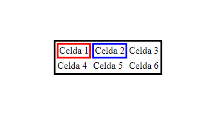
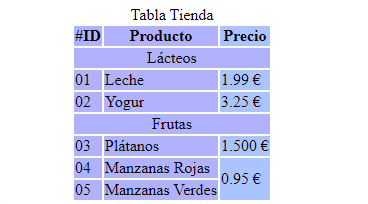

<h1 align="center">Tablas</h1>

<h2>📑 Contenido</h2>

- [Información sobre las tablas](#información-sobre-las-tablas)
- [Elementos de una tabla](#elementos-de-una-tabla)
- [Tablas básicas](#tablas-básicas)
- [Tabla con secciones](#tabla-con-secciones)
- [Celdas](#celdas)

## Información sobre las tablas

- En HTML las tablas se usan para mostrar datos tabulados.
- No usar las tablas para maquetar las páginas.
- Las tablas por defecto no traen bordes remarcados.
- Para visualizar mejor los datos es necesario aplicar estilos CSS.

## Elementos de una tabla

- `<table>` Para insertar una tabla. Esta etiqueta agrupa todos los elementos que componen la tabla.
- `<thead>` Define la sección del encabezado de la table.
- `<tbody>` Define la sección del cuerpo de la tabla.
- `<tfoot>` Define la sección del pie de la tabla..
- `<tr>` Para insertar celdas en filas de la tabla.
- `<td>` Para insertar celdas en las columnas de la tabla.
- `<th>` Para insertar el encabezado de las celdas de la tabla.
- `<caption>` Para insertar el título de la tabla.
- `<colgroup>` Para agrupar las columnas de la tabla.

## Tablas básicas

HTML permite crear tablas sin tener que crear las secciones `<thead>,<tbody> y <tfoot>`

```HTML
<!-- Ejemplo de una tabla básica -->

<!-- El atributo style es simplemente para recalcar los bordes de la tabla = negro y celdas en rojo-azul -->

 <table style="border: solid 3px black">
      <tr>
        <td style="border: solid 3px red">Celda 1</td>

        <td style="border: solid 3px blue">Celda 2</td>

        <td>Celda 3</td>
      </tr>

      <tr>
        <td>Celda 4</td>

        <td>Celda 5</td>

        <td>Celda 6</td>
      </tr>
    </table>
```

Resultado tabla básica:



## Tabla con secciones

```HTML
<!-- Ejemplo de una tabla con secciones -->
<!-- El atributo style es para aplicar estilos en linea, en este caso recalcar las celdas con un color de fondo -->

 <table style="border: solid 3px black">
        <thead style="background-color: #937DC2;">
          <tr>
            <th>#ID</th>
            <th>Cliente</th>
            <th>Monedas</th>
          </tr>
        </thead>
        <tbody style="background-color: #FFD1D1;">
          <tr>
            <td>01</td>
            <td>Cliente-1</td>
            <td>30.000 €</td>
          </tr>
          <tr>
            <td>02</td>
            <td>Cliente-2</td>
            <td>10.000 €</td>
          </tr>
        </tbody>
        <tfoot style="background-color: #FF9494;">
          <tr>
            <td colspan="2">Total</td>
            <td>40.000 €</td>
          </tr>
        </tfoot>
      </table>
```

Resultado tabla con secciones:


## Celdas

En HTML podemos agrupar columnas, filas y celdas. con los atributos y etiquetas `<colgroup>, colspan, rowspan`

- `<caption>`: Es el encargado de darle un título descriptivo a las tablas.
- `<colgroup>`: Agrupar columnas para dar estilos.
- colspan: Unir la columna de dos celdas que se encuentren juntas.
- rowspan: Unir la fila de dos celdas que se encuentren juntas.

```HTML
<!-- Ejemplo uniendo columnas, celdas y filas -->
    <table>
        <colgroup>
          <col span="2" style="background-color: #b1b2ff" />
          <col style="background-color: #aac4ff" />
        </colgroup>
        <caption>Tabla Tienda</caption>
        <tr>
          <th>#ID</th>
          <th>Producto</th>
          <th>Precio</th>
        </tr>
        <tr>
          <td colspan="3" align="center">Lácteos</td>
        </tr>
        <tr>
          <td>01</td>
          <td>Leche</td>
          <td>1.99 €</td>
        </tr>
        <tr>
          <td>02</td>
          <td>Yogur</td>
          <td>3.25 €</td>
        </tr>
        <tr>
          <td colspan="3" align="center">Frutas</td>
        </tr>
        <tr>
          <td>03</td>
          <td>Plátanos</td>
          <td>1.500 €</td>
        </tr>
        <tr>
          <td>04</td>
          <td>Manzanas Rojas</td>
          <td rowspan="2">0.95 €</td>
        </tr>
        <tr>
          <td>05</td>
          <td>Manzanas Verdes</td>
        </tr>
    </table>
```

Resultado ejemplo celdas:


